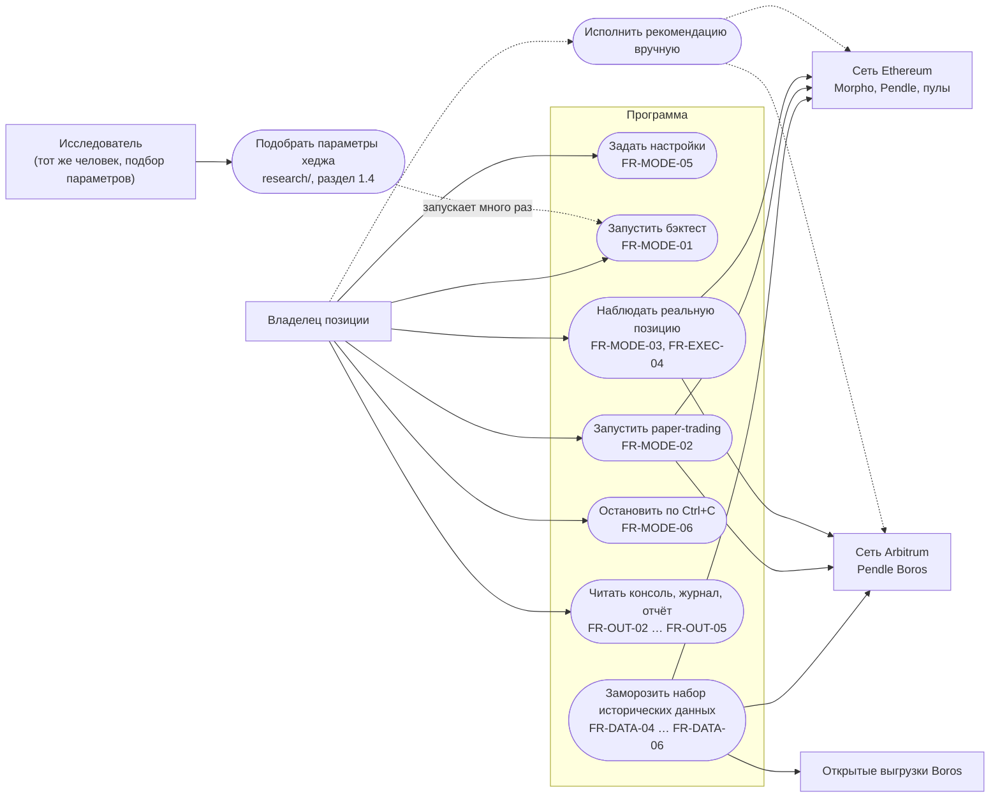
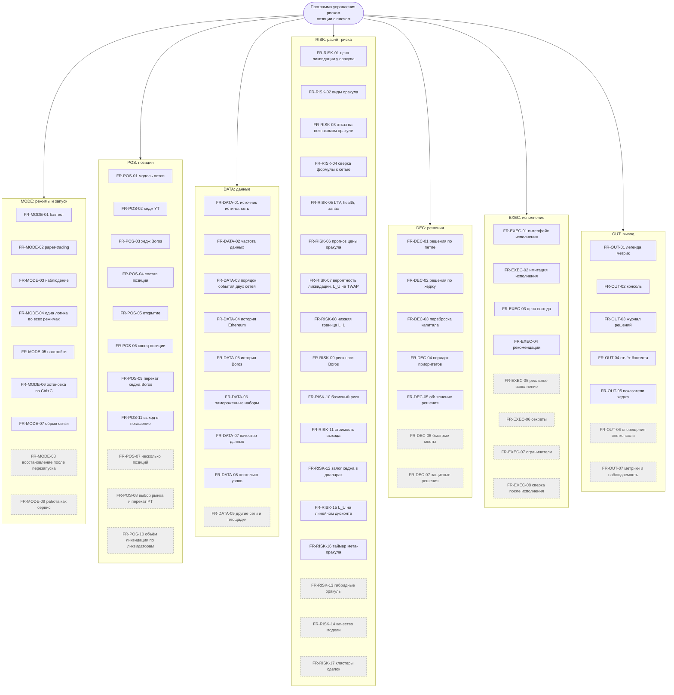
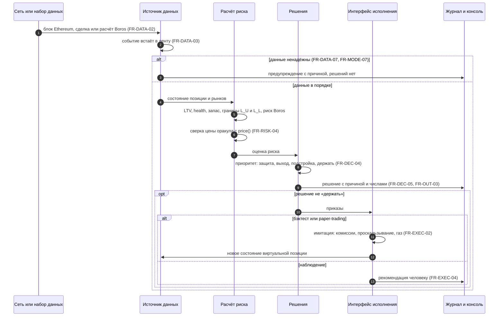
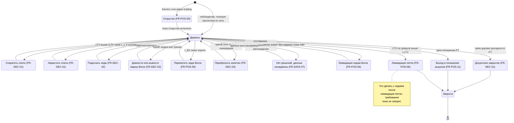

# Схемы требований

**Проект:** Программа для управления риском ликвидации и хеджированием кредитной позиции
с плечом в DeFi.
**Версия:** 0.1, черновик от 28.09.2026. **Автор:** Михаил Швайков.

Схемы показывают требования `functional.md` с разных сторон: кто пользуется программой,
из каких функций она состоит, откуда идут данные, как принимается одно решение и как живёт
позиция. Схемы производны от текста: при расхождении прав `functional.md`. Номера
требований на схемах ведут в него.

Схемы записаны на языке Mermaid. Их рисуют GitHub и встроенный просмотр Markdown в VS Code
(Ctrl+Shift+V).

## 1. Кто и что делает с программой (use case)

Прямоугольники слева и справа: участники вне программы. Овалы: действия. Пунктир:
действие вне программы.

## 2. Дерево функций

Все 68 требований по группам. Серые с пунктирной рамкой: объём «продукт», в учебный
проект не входят.

## 3. Потоки данных

Прямоугольники: внешние источники. Скруглённые: шаги обработки. Цилиндры: хранилища.

```mermaid
flowchart LR
    eth["Узлы Ethereum"]
    arb["Узел Arbitrum"]
    dumps["Выгрузки Boros"]
    sdk["Pendle Hosted SDK"]
    cfg["Файл настроек<br/>FR-MODE-05"]

    load("Загрузка и сверка с сетью<br/>FR-DATA-01, FR-DATA-04, FR-DATA-05")
    frozen[("Замороженные наборы<br/>FR-DATA-06")]
    feed("Лента событий двух сетей<br/>FR-DATA-02, FR-DATA-03, FR-DATA-07")
    risk("Расчёт риска<br/>FR-RISK-01 … FR-RISK-16")
    dec("Решения<br/>FR-DEC-01 … FR-DEC-05")
    exec("Исполнение<br/>FR-EXEC-01 … FR-EXEC-04")
    out("Вывод<br/>FR-OUT-01 … FR-OUT-05")
    journal[("Журнал решений<br/>FR-OUT-03")]
    console["Консоль и отчёт"]
    research["Исследование<br/>research/"]

    eth -->|"события, price(), состояние Morpho"| load
    arb -->|"события Boros, счёт и маржа"| load
    dumps -->|"сделки, стакан, расчёты ставки"| load
    load -->|"бэктест: сохранить"| frozen
    frozen -->|"бэктест: проиграть"| feed
    load -->|"живые режимы"| feed
    feed -->|"состояние позиции и рынков"| risk
    cfg --> risk
    cfg --> dec
    risk -->|"L_U, L_L, запас, риск Boros"| dec
    dec -->|"приказы"| exec
    exec -.->|"котировки пулов, eth_call"| eth
    sdk -.->|"котировка для сравнения, paper-trading"| exec
    exec -->|"новое состояние виртуальной позиции"| feed
    dec -->|"решение с причиной"| out
    exec -->|"затраты, рекомендация"| out
    out --> journal
    out --> console
    journal --> research
```

## 4. Один цикл решения (swimlane)

Дорожки: части программы. Одна и та же последовательность работает во всех режимах
(FR-MODE-04), различается только последний шаг.

## 5. Состояния позиции

Позиция, пока открыта, стоит в состоянии «Держать». Каждое действие после исполнения
возвращает её туда. Если поводов для действий несколько, выбор идёт по FR-DEC-04.

## 6. Требования по шагам процесса

Таблица связывает требования с шагами работы программы. Шаги S1–S3 выполняются при
запуске, S4–S9 повторяются на каждом событии; после исполнения (S8) меняется состояние
позиции (S5). Каждое требование стоит ровно в одной строке столбца «Требования»; если оно
работает ещё на каком-то шаге, оно указано у того шага в последнем столбце.

По этой таблице, `functional.md` и `risks.md` ноутбук `risk-map.ipynb` собирает объёмную
схему `requirements-graph.html`: внизу шаги, над ними требования, выше риски, между ними
связи. Файл открывается в браузере, нужен интернет (библиотека three.js).

| Шаг | Название | Что происходит | Требования | Также работают на шаге |
|---|---|---|---|---|
| S1 | Запуск и настройки | Выбор режима, проверка настроек, подготовка журнала | FR-MODE-01, FR-MODE-02, FR-MODE-03, FR-MODE-05, FR-MODE-08, FR-MODE-09 | |
| S2 | Загрузка данных сетей | События и состояние контрактов Ethereum и Arbitrum, выгрузки Boros, сверка с сетью | FR-DATA-01, FR-DATA-04, FR-DATA-05, FR-DATA-08, FR-DATA-09 | |
| S3 | Замороженные наборы | Скачанное сохраняется набором с версией, бэктест проигрывает только его | FR-DATA-06 | |
| S4 | Лента событий | События двух сетей в одной ленте, проверка свежести и согласованности данных | FR-DATA-02, FR-DATA-03, FR-DATA-07, FR-MODE-07 | |
| S5 | Состояние позиции | Петля и хедж после события: PT в залоге, долг, маржа Boros | FR-POS-01, FR-POS-02, FR-POS-03, FR-POS-04, FR-POS-05, FR-POS-06, FR-POS-07, FR-POS-08, FR-POS-10, FR-MODE-04 | FR-POS-09 |
| S6 | Расчёт риска | LTV и запас по цене оракула, границы коридора, риск ноги Boros, стоимость выхода | FR-RISK-01, FR-RISK-02, FR-RISK-03, FR-RISK-04, FR-RISK-05, FR-RISK-06, FR-RISK-07, FR-RISK-08, FR-RISK-09, FR-RISK-10, FR-RISK-11, FR-RISK-12, FR-RISK-13, FR-RISK-14, FR-RISK-15, FR-RISK-16, FR-RISK-17 | FR-EXEC-03, FR-MODE-04 |
| S7 | Решения | Одно решение по приоритету: защита, выход, подстройка, держать | FR-DEC-01, FR-DEC-02, FR-DEC-03, FR-DEC-04, FR-DEC-05, FR-DEC-06, FR-DEC-07, FR-POS-09, FR-POS-11 | FR-MODE-04 |
| S8 | Исполнение | Приказы через интерфейс исполнения: имитация или рекомендация человеку | FR-EXEC-01, FR-EXEC-02, FR-EXEC-03, FR-EXEC-04, FR-EXEC-05, FR-EXEC-06, FR-EXEC-07, FR-EXEC-08 | FR-POS-05, FR-POS-11 |
| S9 | Вывод | Строка в консоль, запись в журнал, отчёт в конце бэктеста | FR-OUT-01, FR-OUT-02, FR-OUT-03, FR-OUT-04, FR-OUT-05, FR-OUT-06, FR-OUT-07, FR-MODE-06 | |

## 7. Риски и трассировка

- Карта рисков и реестр: `risks.md`.
- Матрица трассировки «риск → требования» и «требование → риски»: `traceability.md`.
  Её собирает ноутбук `risk-map.ipynb`.

## 8. Журнал изменений

| Дата | Версия | Изменение |
|---|---|---|
| 28.09.2026 | 0.1 | Первый черновик. |
