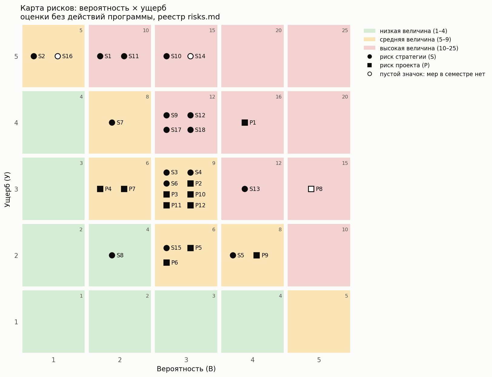

# Реестр рисков

**Проект:** Программа для управления риском ликвидации и хеджированием кредитной позиции
с плечом в DeFi.
**Версия:** 0.1, черновик от 28.09.2026. **Автор:** Михаил Швайков.

Реестр перечисляет события, которые грозят деньгам владельца позиции (риски стратегии) и
сроку или объёму учебного проекта (риски проекта). Для каждого риска оценены вероятность и
ущерб, их произведение даёт величину риска. Из рисков стратегии выводятся функциональные
требования (`functional.md`): требование либо снижает вероятность события, либо
уменьшает ущерб. Риски проекта попадут в план работ.

Карту рисков и файл трассировки `traceability.md` собирает ноутбук `risk-map.ipynb` из
таблицы раздела 2 и из `functional.md`. Руками правится только этот файл.

## 1. Как читать

**Вероятность (В).** Для рисков стратегии: за жизнь одной позиции (от открытия до
погашения PT, несколько месяцев) при настройках по умолчанию (целевой LTV 0.80) и **без
действий программы**. Так видно, от чего программа должна защищать. Для рисков проекта: за
семестр.

| В | Стратегия | Проект |
|---|---|---|
| 1 | меньше 1%: на истории рынков не наблюдалось | почти исключено |
| 2 | 1–5% | маловероятно |
| 3 | 5–20% | возможно |
| 4 | 20–50% | вероятно |
| 5 | больше 50% | почти наверняка |

**Ущерб (У).**

| У | Стратегия: потеря капитала позиции | Проект |
|---|---|---|
| 1 | меньше 0,1% | задержка на 1–2 дня |
| 2 | 0,1–1% | задержка до недели |
| 3 | 1–5% | несколько недель или переделка модуля |
| 4 | 5–20% | часть требований семестра переходит в «продукт» |
| 5 | больше 20% | к сроку нет работающей программы |

**Величина риска** = В × У. Зоны: 1–4 низкая, 5–9 средняя, 10–25 высокая.

**Правила.**

1. У риска из высокой зоны есть мера в семестре или записано, почему её нет: риск принят
   или в семестре не возникает.
2. Мера против риска стратегии это требование FR. Мера против риска проекта это шаг плана
   работ или требование.
3. Оценки пересматриваются по данным. Оценка, которую уточнят данные, помечена
   [ПОДТВЕРДИТЬ данными].
4. Требование, которое не закрывает ни одного риска, не обязательно лишнее: режимы и вывод
   следуют из назначения программы. Такие требования перечислены в `traceability.md`.

**Карта.** Круг означает риск стратегии, квадрат означает риск проекта. Закрашенный значок:
у риска есть меры в семестре. Пустой: мер в семестре нет. На карте номер RS-01 подписан S1,
номер RP-01 подписан P1.

## 2. Сводная таблица

Таблицу читает ноутбук: столбцы и формат номеров не менять без правки ноутбука.

| № | Риск | Вид | В | У | В×У | Меры в семестре | Меры в продукте |
|---|---|---|---|---|---|---|---|
| RS-01 | Скачок implied yield на рынке с TWAP-оракулом, ликвидация петли | стратегия | 2 | 5 | 10 | FR-RISK-01, FR-RISK-02, FR-RISK-05, FR-RISK-06, FR-RISK-07, FR-DEC-01, FR-DEC-04, FR-DATA-02 | FR-RISK-17 |
| RS-02 | Депег USDe и переключение мета-оракула, ликвидация петли | стратегия | 1 | 5 | 5 | FR-RISK-02, FR-RISK-15, FR-RISK-16, FR-DEC-01, FR-MODE-05 | |
| RS-03 | Ставка займа выше доходности PT | стратегия | 3 | 3 | 9 | FR-POS-01, FR-RISK-05, FR-RISK-08, FR-RISK-11, FR-DEC-01 | |
| RS-04 | Ликвидация хеджа Boros | стратегия | 3 | 3 | 9 | FR-POS-03, FR-POS-06, FR-RISK-09, FR-DEC-02, FR-DEC-04, FR-DATA-05 | |
| RS-05 | Хедж движется не так, как цена PT (базисный риск) | стратегия | 4 | 2 | 8 | FR-RISK-10, FR-DEC-02, FR-OUT-05 | |
| RS-06 | Нет ликвидности для выхода | стратегия | 3 | 3 | 9 | FR-POS-11, FR-RISK-11, FR-EXEC-03, FR-DEC-01 | |
| RS-07 | Капитал нужен в другой сети | стратегия | 2 | 4 | 8 | FR-DEC-03 | FR-DEC-06 |
| RS-08 | Перекат хеджа Boros невозможен или дорог | стратегия | 2 | 2 | 4 | FR-POS-09 | |
| RS-09 | Данные программы устарели или неверны | стратегия | 3 | 4 | 12 | FR-DATA-07, FR-DATA-08, FR-MODE-07 | FR-DEC-07 |
| RS-10 | Ошибка в формулах программы | стратегия | 3 | 5 | 15 | FR-RISK-04, FR-DATA-01, FR-DATA-04, FR-DATA-05, FR-POS-01, FR-POS-03 | |
| RS-11 | Незнакомый вид оракула у рынка | стратегия | 2 | 5 | 10 | FR-RISK-01, FR-RISK-03 | FR-RISK-13 |
| RS-12 | Модель недооценивает хвост распределения | стратегия | 3 | 4 | 12 | FR-RISK-07 | FR-RISK-14, FR-RISK-17 |
| RS-13 | Затраты на сделки съедают доход | стратегия | 4 | 3 | 12 | FR-EXEC-02, FR-RISK-08, FR-DEC-02, FR-OUT-04, FR-OUT-05 | |
| RS-14 | Ошибка реального исполнения | стратегия | 3 | 5 | 15 | | FR-EXEC-05, FR-EXEC-06, FR-EXEC-07, FR-EXEC-08, FR-MODE-08 |
| RS-15 | Долларовая стоимость залога хеджа падает вместе с ETH | стратегия | 3 | 2 | 6 | FR-RISK-12 | |
| RS-16 | Взлом или сбой протокола | стратегия | 1 | 5 | 5 | | |
| RS-17 | Человек не видит рекомендацию вовремя | стратегия | 3 | 4 | 12 | FR-EXEC-04, FR-DEC-05, FR-OUT-02 | FR-OUT-06, FR-MODE-09 |
| RS-18 | Рост implied yield обесценивает позицию при досрочном выходе | стратегия | 3 | 4 | 12 | FR-POS-02, FR-POS-03, FR-POS-04, FR-DEC-02, FR-RISK-10 | |
| RP-01 | Объём семестра больше учебного времени | проект | 4 | 4 | 16 | перенос требований приоритета 2 в «продукт» (functional.md, раздел 4); каждый шаг плана даёт работающую программу | |
| RP-02 | Монте-Карло не укладывается в точность или скорость | проект | 3 | 3 | 9 | прототип первым шагом плана (FR-RISK-07), точка решения владельца | |
| RP-03 | Бесплатные узлы закрывают доступ к истории | проект | 3 | 3 | 9 | FR-DATA-06, FR-DATA-08; ключ провайдера как запасной путь | |
| RP-04 | Выгрузки Boros пропадают или меняют формат | проект | 2 | 3 | 6 | FR-DATA-06, FR-DATA-05 | |
| RP-05 | Протоколы меняют контракты или API | проект | 3 | 2 | 6 | FR-DATA-01 | |
| RP-06 | Эталон на Python сам ошибается | проект | 3 | 2 | 6 | FR-DATA-01, FR-RISK-04 | |
| RP-07 | Сборка не воспроизводится в другом окружении | проект | 2 | 3 | 6 | Dockerfile и CI (технические требования) | |
| RP-08 | Живой рынок погашается раньше конца семестра | проект | 5 | 3 | 15 | | |
| RP-09 | Требования и код расходятся | проект | 4 | 2 | 8 | functional.md, раздел 5; проверки ноутбука risk-map.ipynb | |
| RP-10 | Дата сдачи не объявлена | проект | 3 | 3 | 9 | план с датами [ПОДТВЕРДИТЬ] | |
| RP-11 | Один разработчик: любая пауза останавливает проект | проект | 3 | 3 | 9 | промежуточный результат каждые 1–2 недели | |
| RP-12 | Прогоны бэктеста не повторяются | проект | 3 | 3 | 9 | FR-OUT-03, FR-DATA-03, FR-DATA-06, FR-MODE-04 | |

## 3. Риски стратегии

Числа ниже посчитаны для живого рынка PT-sUSDE-26NOV2026/USDC: LLTV 0.915, штраф
ликвидации LIF = 1 / (0.3·0.915 + 0.7) ≈ 1.026. При целевом LTV 0.80 залог равен пяти
капиталам, и до ликвидации цена залога по оракулу должна упасть на 1 − 0.80/0.915 ≈ 12,6%.
В этой точке бумажный убыток около 63% капитала. Позиция, дожившая до погашения, этот
убыток отыгрывает; ликвидация делает его настоящим и добавляет штраф. Поэтому ущерб любой
ликвидации петли оценён в 5.

### RS-01. Скачок implied yield на рынке с TWAP-оракулом

На историческом рынке цена оракула следует за средней за 15 минут implied rate. Чтобы цена
упала на 12,6%, средняя ставка должна вырасти на 0,134/τ: при τ = 0,5 года примерно с 5% до
37% годовых. Для sUSDe это крайний случай, отсюда В = 2 [ПОДТВЕРДИТЬ данными: наибольший
рост средней ставки за 15 минут на рынках 2025 года]. При целевом LTV ближе к LLTV
вероятность резко растёт: 25.08.2026 падение PT-reUSD на 3% привело к ликвидациям на
десятки миллионов долларов (по сообщениям со ссылкой на Pendle).
Остаётся после мер: скачок быстрее, чем программа успевает сократить плечо.

### RS-02. Депег USDe на рынке с линейным дисконтом

Цена залога по основному источнику детерминирована, но через 16 часов расхождения
мета-оракул переключается на резервный источник с ценой USDe. При LTV 0.80 позиция
переживает депег до 12,6%, при LTV 0.88 только до 3,8%. Длительный депег на 12,6% за жизнь
позиции оценён как очень редкий, В = 1 [ПОДТВЕРДИТЬ данными: история USDe/USD].
Остаётся после мер: депег больше заданного X, если плечо не успели сократить за 16 часов.

### RS-03. Ставка займа выше доходности PT

При утилизации 100% ставка AdaptiveCurveIRM сразу вчетверо выше целевой и дальше растёт.
17.09.2026 ставка займа была 3,62% против implied APY PT 4,91% при утилизации 90,4%.
Месяц ставки 10% при доходности PT 4,9% и плече 5 стоит около 1,3% капитала. На рынке с
линейным дисконтом такая ставка ещё и медленно поднимает LTV (накопление оракула 6%).
Остаётся после мер: стоимость выхода, если закрываться приходится в плохой момент.

### RS-04. Ликвидация хеджа Boros

Позиция long YU теряет, когда ставка рынка Boros падает. Ликвидация при Net Balance ниже
MM, штраф k·MM. Ущерб: штраф и потеря защиты, петля остаётся без хеджа.
Остаётся после мер: быстрое падение ставки при нехватке капитала в Arbitrum (RS-07).

### RS-05. Базисный риск

Boros торгует ставкой финансирования ETH или BTC на биржах, петля зависит от implied yield
PT-sUSDe. Связь неточная, поэтому хедж то перестраховывает, то недостраховывает. Для YT
связь точная по построению.

### RS-06. Нет ликвидности для выхода

В исследовании Pendle PT-Loop потери у погашения возникли от продажи через обедневший пул
уже после срока. При досрочном выходе в стрессе котировка хуже всего как раз тогда, когда
выходить нужнее всего. В погашение выход идёт выкупом по номиналу, без пула.

### RS-07. Капитал нужен в другой сети

Родной мост из Arbitrum в Ethereum идёт 6,4 дня, перевод USDC через Circle CCTP 15–19
минут. Деньги в пути не защищают ни одну ногу.

### RS-08. Перекат хеджа Boros невозможен или дорог

Рынки Boros месячные. Если рынка со следующим сроком нет или стакан тонкий, хедж пропадает
или перекат стоит дорого.

### RS-09. Данные программы устарели или неверны

Бесплатные узлы отказывают и меняют ограничения без предупреждения (проверено 17.09 и
19.09.2026), а отстают узлы как раз в стрессе. Решение по устаревшему состоянию опаснее
отсутствия решения. В семестре программа при ненадёжных данных решений не принимает;
защитные решения по худшей оценке (FR-DEC-07) вынесены в продукт.

### RS-10. Ошибка в формулах программы

Ошибка в формуле оракула, долга или mark rate незаметно искажает весь расчёт риска.
Меры: сверка каждой величины с вызовом контракта на известных блоках.

### RS-11. Незнакомый вид оракула у рынка

Гибридные оракулы («минимум из TWAP и линейного дисконта») есть у живых рынков PT-reUSD и
PT-sUSDS. Если программа посчитает такой рынок по формуле другого вида, риск будет неверным.
Мера в семестре: отказ считать риск с именем незнакомого компонента.

### RS-12. Модель недооценивает хвост распределения

Параметры модели калибруются на истории, а режим рынка меняется; сделки приходят
всплесками. Уровень 10⁻⁴ на доступной истории не проверяется (FR-RISK-07).

### RS-13. Затраты на сделки съедают доход

В исследовании Pendle PT-Loop учёт газа изменил вывод: без хеджа петля при капитале $10k
убыточна. Частые подгонки хеджа и ребалансировки делают то же самое.

### RS-14. Ошибка реального исполнения

Повторная отправка приказа, неудачная транзакция, нет аварийной остановки (случай Knight
Capital, 2012). **В семестре не возникает:** программа не подписывает и не отправляет
транзакций (`functional.md`, раздел 1.2). Меры вынесены в продукт.

### RS-15. Долларовая стоимость залога хеджа падает вместе с ETH

У рынков Boros на ETH залог в ETH. Риск ликвидации хеджа от цены ETH не растёт, но
страховой капитал в долларах дешевеет.

### RS-16. Взлом или сбой протокола

Ошибка в контракте Morpho, Pendle, Boros или Ethena. **Риск принят:** программа от него
защитить не может, мера лежит вне программы (сколько капитала вкладывать).

### RS-17. Человек не видит рекомендацию вовремя

В режиме наблюдения решение исполняет человек, а рекомендация выводится только в консоль.
Если человек не у экрана, защита не срабатывает. В семестре риск принят: денег программа не
касается. Оповещения вне консоли вынесены в продукт.

### RS-18. Рост implied yield обесценивает позицию при досрочном выходе

Рост implied yield на 2 п. п. при τ = 0,5 года снижает рыночную цену PT примерно на 1%, при
плече 5 это около 5% капитала. Пока позиция держится до погашения, убыток бумажный; он
становится настоящим, если выходить приходится раньше (отрицательный carry, угроза
ликвидации, решение владельца). Против этого риска и нужен хедж: YT или Boros дорожают,
когда PT дешевеет. На рынке с линейным дисконтом хедж защищает только от этого риска, не от
ликвидации (`functional.md`, раздел 1.3).
Остаётся после мер: доля ρ < 1 (полный хедж убирает фиксированную доходность) и базисный
риск (RS-05).

## 4. Риски проекта

### RP-01. Объём семестра больше учебного времени

В семестре 51 требование, из них 10 с оценкой L. Если объём не поместится, в «продукт»
переносится второстепенное, и программа на каждом шаге остаётся работающей.

### RP-02. Монте-Карло не укладывается в точность или скорость

FR-RISK-07 имеет реализуемость «под вопросом». Прототип идёт первым шагом плана; если
пороги не выполнены, способ выбирается заново решением владельца, без автоматического
перехода на упрощённую формулу.

### RP-03. Бесплатные узлы закрывают доступ к истории

Условия бесплатных узлов менялись на глазах (проверки 17.09 и 19.09.2026). Скачанное
замораживается сразу, для каждой сети задано несколько узлов.

### RP-04. Выгрузки Boros пропадают или меняют формат

Выгрузки открытые, но их владелец ничего не обещает. Скачанное замораживается сразу.

### RP-05. Протоколы меняют контракты или API

Примеры: в мае 2026 Morpho убрал запрос `marketByUniqueKey` из GraphQL API, к 28.09.2026 у
рынка нет и поля `uniqueKey` (теперь `marketId`). Источник истины сеть, API только со
сверкой.

### RP-06. Эталон на Python сам ошибается

Эталон нужен для сверки чисел, но сам он не истина. Первичная сверка идёт с сетью.

### RP-07. Сборка не воспроизводится в другом окружении

Меры описываются в технических требованиях: эталонная среда в Docker и проверка в CI.

### RP-08. Живой рынок погашается раньше конца семестра

Рынок живых режимов PT-sUSDE-26NOV2026/USDC погашается 26.11.2026, а семестр идёт дольше.
После погашения paper-trading и наблюдение на нём показать нельзя. **Мер пока нет.** Рынок
задаётся в настройках (FR-MODE-05), поэтому программа от замены рынка не меняется, если у
нового рынка поддерживаемый оракул.

Проверка 28.09.2026 (API Pendle и Morpho, цепочки оракулов по контрактам):

- другого рынка PT-sUSDe в Pendle на Ethereum нет, в Morpho нет рынка PT-sUSDe/USDC со
  сроком позже 26.11.2026; в 2026 году такие рынки уже пропадали с февраля до августа;
- рынки PT со сроком после начала декабря 2026 года и займом от $0,1 млн: PT-reUSD-10DEC2026
  (гибридный оракул, в семестре не поддерживается, FR-RISK-13), PT-USD3-17DEC2026/USDC
  (линейный дисконт через незнакомый компонент `PendleLinearDiscountOracleWrapper`),
  PT-USDat-14JAN2027/USDC (займ $1,7 млн; основной источник TWAP 900 с, как у исторических
  рынков sUSDe, внутри мета-оракула с порогом 1%, 4 ч и 12 ч; резервный источник через
  незнакомый компонент `OracleRouter`).

### RP-09. Требования и код расходятся

Требования меняются только через pull request с записью в журнале изменений. Ноутбук
`risk-map.ipynb` проверяет, что номера требований в этом реестре существуют и объём
указан верно.

### RP-10. Дата сдачи не объявлена

План строится с датами [ПОДТВЕРДИТЬ] и пересчитывается, когда дата станет известна.

### RP-11. Один разработчик

Любая пауза останавливает проект. Промежуточный работающий результат каждые 1–2 недели
делает паузу дешевле: программа в любой момент в рабочем состоянии.

### RP-12. Прогоны бэктеста не повторяются

Параметры хеджа выбираются исследованием по сотням прогонов бэктеста (`functional.md`,
раздел 1.4). Если повторный прогон даёт другой журнал, улучшение нельзя отличить от
случайности, и выбор параметров ничего не доказывает. Меры: одинаковый журнал на повторном
прогоне, фиксированный порядок событий, замороженные наборы данных, одна логика во всех
режимах.

## 5. Журнал изменений

| Дата | Версия | Изменение |
|---|---|---|
| 28.09.2026 | 0.1 | Первый черновик. |
